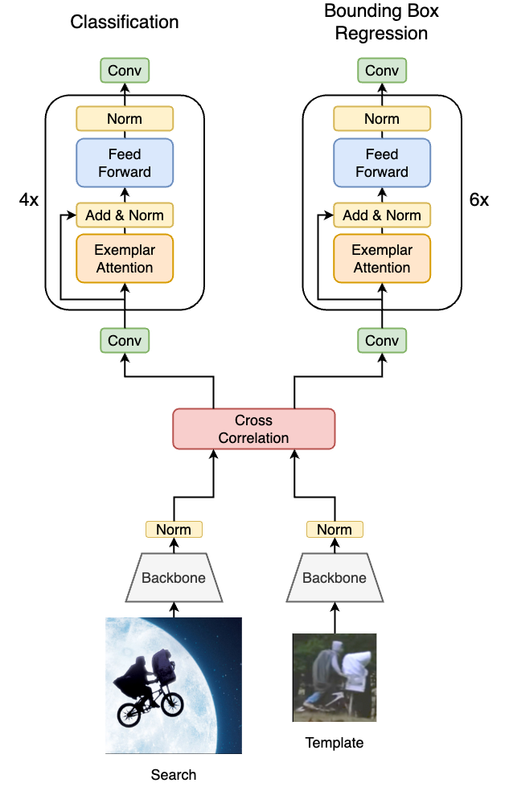
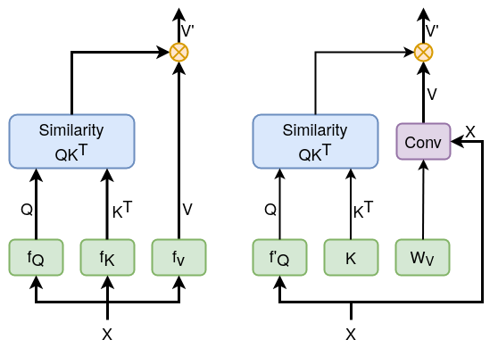

# E.T.Track - Efficient Visual Tracking with Exemplar Transformers
Official implementation of E.T.Track. 
E.T.Track utilized our proposed Exemplar Transformer, a transformer module utilizing a single instance level attention layer for realtime visual object tracking.
E.T.Track is up to 8x faster than other transformer-based models, and consistently outperforms competing lightweight trackers that can operate in realtime on standard CPUs. 


E.T.Track        |  Our Exemplar Attention (right) vs the [standard attention](https://proceedings.neurips.cc/paper/2017/file/3f5ee243547dee91fbd053c1c4a845aa-Paper.pdf) 
:----------------------------------------------------------:|:----------------------------------------------------------:
   |  

## Installation

#### Install dependencies

Install the python environment using the environment file `ettrack_env.yml`.

Generate the relevant files:
```
python -c "from pytracking.evaluation.environment import create_default_local_file; create_default_local_file()"
python -c "from ltr.admin.environment import create_default_local_file; create_default_local_file()"
```

* Modify local.py.
    Modify the path files for the evaluation in `pytracking/evaluation/local.py`

[comment]: <> (## Data preparation)

[comment]: <> (* Data preparation is based on the scripts from [here]&#40;https://github.com/researchmm/TracKit/tree/master/lib/dataset/crop&#41;. <br />)

[comment]: <> (* Place the [COCO]&#40;https://cocodataset.org/&#41;, [GOT-10k]&#40;http://got-10k.aitestunion.com/&#41;, [LaSOT]&#40;http://vision.cs.stonybrook.edu/~lasot/&#41;, and [TrackingNet]&#40;https://tracking-net.org/&#41; datasets following the file structure below)

[comment]: <> (```)

[comment]: <> (datasets)

[comment]: <> (├── coco)

[comment]: <> (│   ├── train2017)

[comment]: <> (│   ├── val2017)

[comment]: <> (│   └── annotations)

[comment]: <> (├── got10k)

[comment]: <> (│   ├── train)

[comment]: <> (│   │   ├── GOT-10k_Train_000001/)

[comment]: <> (│   │   ├── ...)

[comment]: <> (│   │   ├── GOT-10k_Train_009335/)

[comment]: <> (│   │   └── list.txt)

[comment]: <> (│   └── val)

[comment]: <> (│       ├── GOT-10k_Val_000001/)

[comment]: <> (│       ├── ...)

[comment]: <> (│       ├── GOT-10k_Val_009335/)

[comment]: <> (│       └── list.txt)

[comment]: <> (├── LaSOTBenchmark)

[comment]: <> (│   ├── airplane)

[comment]: <> (│   │   ├── airplane-1)

[comment]: <> (│   │   ├── ...)

[comment]: <> (│   │   └── airplane-20)

[comment]: <> (│   ├── ...)

[comment]: <> (│   └── zebra)

[comment]: <> (│       ├── zebra-1)

[comment]: <> (│       ├── ...)

[comment]: <> (│       └── zebra-20)

[comment]: <> (└── trackingnet)

[comment]: <> (    ├── TRAIN_0)

[comment]: <> (    │   ├── anno)

[comment]: <> (    │   └── frames)

[comment]: <> (    ├── ...)

[comment]: <> (    └── TRAIN_3)

[comment]: <> (        ├── anno)

[comment]: <> (        └── frames    )

[comment]: <> (```)

[comment]: <> (* Execute the dataset preparation with: )

[comment]: <> (```)

[comment]: <> (python -m lib.dataset.crop.dataset_gen)

[comment]: <> (```)

[comment]: <> (* Modify the paths to the training data directory and the annotations json file in `tracking/basic_model/et_tracker.yaml`)


## Download checkpoints

[comment]: <> (* LightTrack SuperNet checkpoint used for the initialization of the backbone when training a new model:)

[comment]: <> (```)

[comment]: <> (wget https://data.vision.ee.ethz.ch/kanakism/LT_SuperNet.tar -P ./checkpoints/supernet/ )

[comment]: <> (```)
* Trained E.T.Track model for inference:
```
wget https://data.vision.ee.ethz.ch/kanakism/checkpoint_e35.pth -P ./checkpoints/et_tracker/ 
```

[comment]: <> (## Training)

[comment]: <> (* Runing the following commands to train the E.T.Tracker.)

[comment]: <> (    ```bash)

[comment]: <> (    conda activate <ENV NAME>)

[comment]: <> (    cd exemplar-transformer-tracking)

[comment]: <> (    bash tracking/basic_model/training.sh)

[comment]: <> (    ```  )

## Evaluation
We evaluate our models using [PyTracking](https://github.com/visionml/pytracking).
* Add the correct dataset in `pytracking/experiments/myexperiments.py` (default: OTB-100)
* Run `python3 -m pytracking.run_experiment myexperiments et_tracker --threads 0`

## Citation

If you use this code, please consider citing the following paper:

```
@article{blatter2021efficient,
  title={Efficient Visual Tracking with Exemplar Transformers},
  author={Blatter, Philippe and Kanakis, Menelaos and Danelljan, Martin and Van Gool, Luc},
  journal={arXiv preprint arXiv:2112.09686},
  year={2021}
}
```